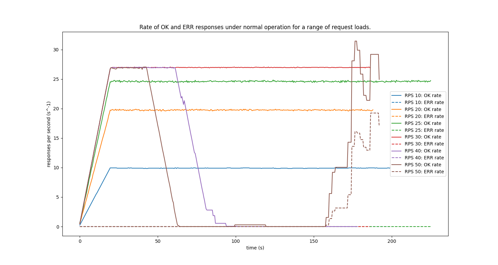
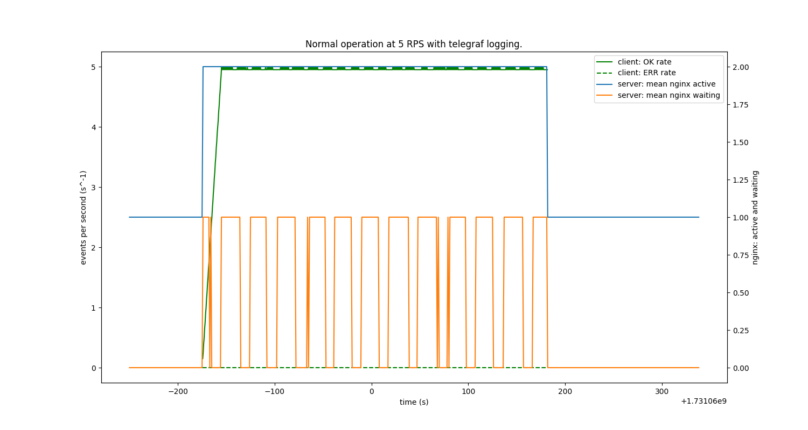
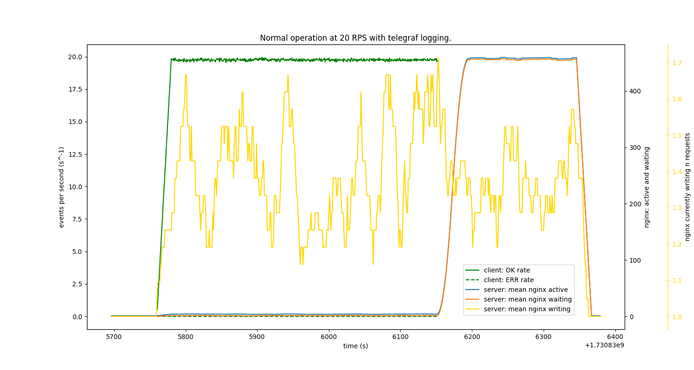
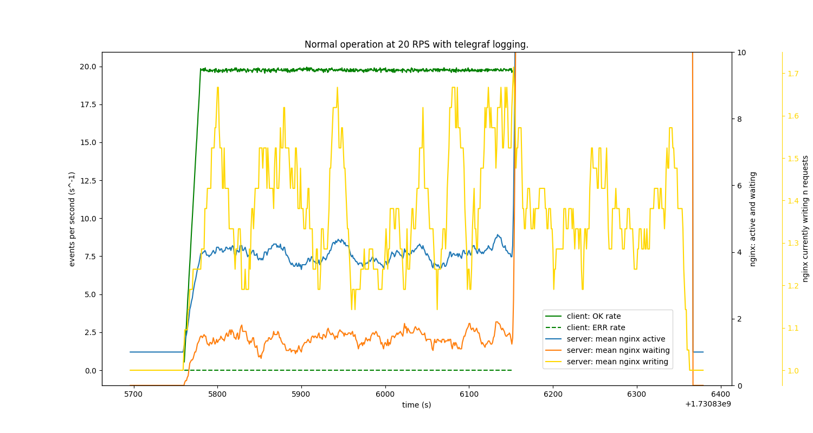
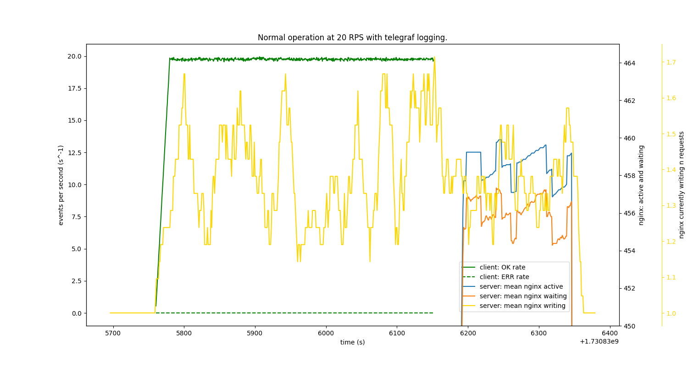
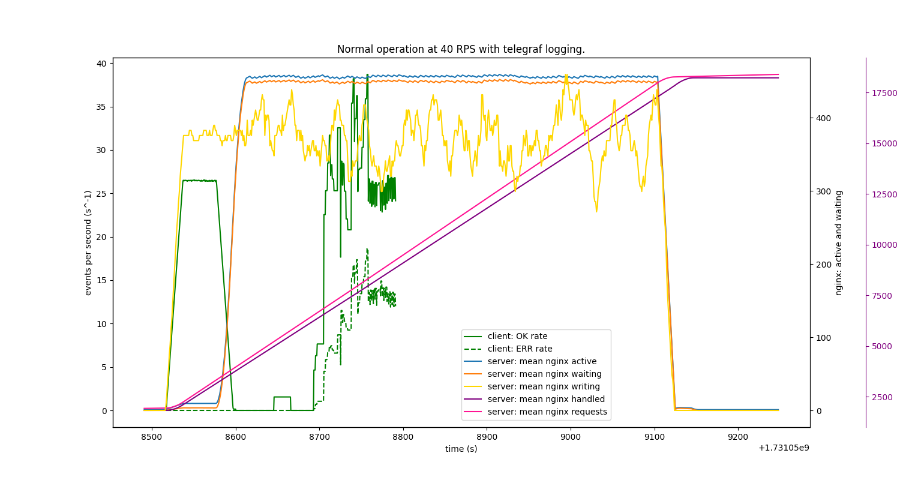

### What's the highest request rate the server can handle?
In the absence of any denial of service attacks, under _normal operation_ and for a range of client request loads, it appears there is a **maximum instantaneous response rate** imposed by the server.

The **maximum instantaneous response rate** seems to be 27 Requests Per Second (RPS). Another conclusion is that loads with a request rate significantly higher than this, e.g. 40 RPS and 50 RPS, experience a sudden drop to a response rate to 0. This happens sooner, the higher the request rate. It's worth noting that the ERR response rate (dashed lines) remain at 0 during this period: traffic returning from the server stops entirely.

However, the responses do not stop indefinitely. After a delay a flurry of OK and ERR responses return from the server, interestingly not bound by the previous 27 RPS 'limit'. Upon inspection, **the majority of the ERR responses are time-outs**. 

A tentative (but I think incorrect) conclusion from this is that the server can handle loads up to 27 RPS without forming queues and causing transient effects. But the log files on the client device only tell part of the story.

### Are the RPS limitations imposed by Nginx?
There are some useful metrics readily available from Nginx servers: the current number of `active`, `reading`, `writing` and `waiting` requests; and the total number of `requests`, `accepts` and `handled` requests.

For a low request load of 5 RPS, `active` and `waiting` requests behave pretty much as expected. Either 0 or 1 requests are waiting at any one time during the application of the request load, 0 requests waiting before and after the request load is applied. There is always 1 `active` connection, even in the absence of a request load - this is the connection to the proxied Node application.

With a higher request load of 20 RPS, which is still below the supposed **maximum server response rate** of 27 RPS, the `active` and `waiting` metrics from Nginx are confusing.

The response rate appears to be roughly 20 responses per second, matching the request rate of 20 RPS. Logically, we _wouldn't_ expect a queue to be building up. However when the request load is terminated (by killing the `getting` process - note this is not a 'clean' termination: open connections are not waited for or handled gracefully), **the number of `active` and `waiting` nginx requests suddenly jumps to around 450**. After some time `active` and `waiting` do drop to 1 and 0, respectively, which is the expected behaviour. The same plot with the 'nginx active and waiting' y axis rescaled in two different ways is useful to confirm this detail.

Both plots also include a rolling mean for the number of responses that nginx is curretnly `writing`. This confirms that Nginx is indeed still writing responses to a backlog (still unsure how a queue has come about) of requests after the `getting` process has been terminated (the client is no longer logging responses, even if they _were_ arriving at the network interface).

**Theory 1:** There is a large volume of requests that 'flushed' from the channels in the client application at the point it is terminated. Nginx handles these 3 requests at a time (note `active` connections _includes_ `waiting` requests), hence `active` is a always `waiting` + 3, as it whilst the request load was applied.

**Theory 2:** Terminating the `getting` process abruptly closes lots of open connections between the client and Nginx, giving Nginx much more 'connection bandwidth' to accept 450 more connections (to the upstream perhaps?). The `worker_connections` Nginx directive sets the maximum number of simultaneous connections that an Nginx worker process can have open (the default is **512**). All types of connections (for example, connections with proxied servers) count against the maximum, not just client connections. Given that Nginx isn't (yet) configured to 'keep alive' connections to the proxied upstream Node server, there will be as many connection to the upstream as the client, which may be approaching or exceeding 512.

The same experiment was run with a much higher request load of 40 RPS. What do the Nginx metrics show when the response rate observed by the client drops to 0, shortly after a request load > 27 RPS begins?

